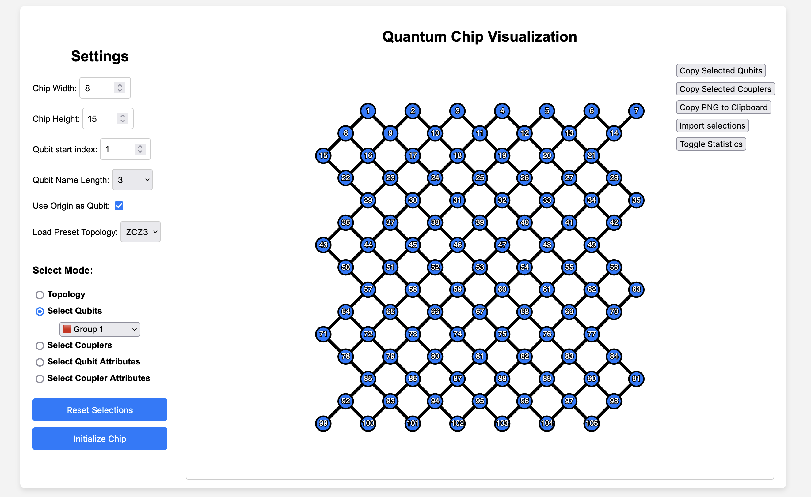

# QSelector

This simple tool is designed to alleviate the pain of manually typing qubit/coupler names in experimental scripts.

Through a visual interface, users can quickly select desired qubits/couplers and easily copy their list or dictionary with attribute values to the clipboard. This copied content can then be pasted directly into the experimental script.


## Overview



## Getting Started

You can use the online version of the tool [QSelector](https://inmzhang.github.io/qselector/).

Or, to start locally, simply pull up a server in the terminal(or just open the `index.html` file in your browser directly, but some features may not work properly due to the security policy of the browser):

```shell
cd qselector
python -m http.server
```

## Reference

There are two main regions in the tool: the settings sidebar and the canvas visualizing the quantum chip.
In the canvas, qubits are represented as circles and couplers as lines connecting them. The qubits are labeled with their ids.

### Settings

The default topology of the chip is a checkerboard pattern. The settings sidebar allows users to change the standard width and height of the chip, as well as a exchange between the odd and even lines.


#### Topology settings

- **Chip Width:** Maximum number of qubits in a row.
- **Chip Height:** Number of rows of qubits.
- **Qubit Start Index:** The index of the first qubit.
- **Qubit Name Length:** The length of the digit parts of the qubit name, e.g. `Q01`(2) or `Q001`(3).
This decides the number of zeros should be padded to the qubit name. Currently, only 2 and 3 can be selected.
- **Use Origin as Qubits:** Exchange the odd and even lines, so that the number 
of qubits in the even lines is greater than that in the odd lines.
- **Load Preset Topology:** Load a preset topology from the dropdown list. Currently,
`ZCZ2`/`ZCZ3`/`Sycamore` are supported. Default to Null, which means no preset will be loaded.

#### Select Mode

A mode corresponds to a specific action when clicking on the canvas. Currently, there are 
five modes:

1. **Topology:** Change the chip's topology with the following actions:
   - **Disable Qubit:** <u>Single Click</u> on the qubits to disable a qubit, which means the qubit will
   stay on the chip but marked as not used.
   - **Disable Coupler:** <u>Single Click</u> on the couplers to disable a coupler, which means the coupler
    will stay on the chip but marked as not used.
   - **Delete Qubit:** <u>Double Click</u> on a qubit to remove it as well as all the couplers connected to it.

2. **Select Qubits:** 
    - <u>Single Click</u> on the qubits to mark it as selected. The selected qubits will be highlighted in red.
    - <u>Drag and select</u> a region to select multiple qubits at once.
    - When click on the <u>Copy Selected Qubits</u> button on the top-right side, the selected qubits will be 
    copied to the clipboard as a python list, e.g. `['Q001', 'Q002', ...]`

3. **Select Couplers:**
    - <u>Single Click</u> on the couplers to mark it as selected. The selected couplers will be highlighted in red.
    - <u>Drag and select</u> a region to select multiple couplers at once.
    - When click on the <u>Copy Selected Couplers</u> button on the top-right side, the selected couplers will be
    copied to the clipboard as a python list, e.g. `['G0901', 'G2820', ...]`

4. **Select Qubits Attributes:** 
    - <u>Single Click</u> on the qubits to pop up a prompt to set the qubit's attributes. The input you typed
    in will be treated as a raw javascript string, which will finally be converted to a python primitive type.
    For example, `0` will finally be converted to integer `0` while `"0"` will be converted to string `"0"` in
    Python. If you input something in the prompt and select `Ok`, the attribute will be saved and the qubit will
    be marked as selected. If you empty the input in the prompt and select `OK`, the qubit will be marked not selected. If you select `Cancel`, the qubit state will stay the same as before.
    - When click on the <u>Copy Selected Qubits</u> button on the top-right side, the selected qubits will be copied to the clipboard as a python dictionary, e.g. `{'Q001': 'attribute1', 'Q002': 'attribute2', ...}`

5. **Select Couplers Attributes:**
    - <u>Single Click</u> on the couplers to pop up a prompt to set the coupler's attributes. The input you typed
    in will be treated as a raw javascript string, which will finally be converted to a python primitive type.
    For example, `0` will finally be converted to integer `0` while `"0"` will be converted to string `"0"` in
    Python. If you input something in the prompt and select `Ok`, the attribute will be saved and the coupler will
    be marked as selected. If you empty the input in the prompt and select `OK`, the coupler will be marked not selected. If you select `Cancel`, the coupler state will stay the same as before.
    - When click on the <u>Copy Selected Couplers</u> button on the top-right side, the selected couplers will be copied to the clipboard as a python dictionary, e.g. `{'G0901': 'attribute1', 'G2820': 'attribute2', ...}`
